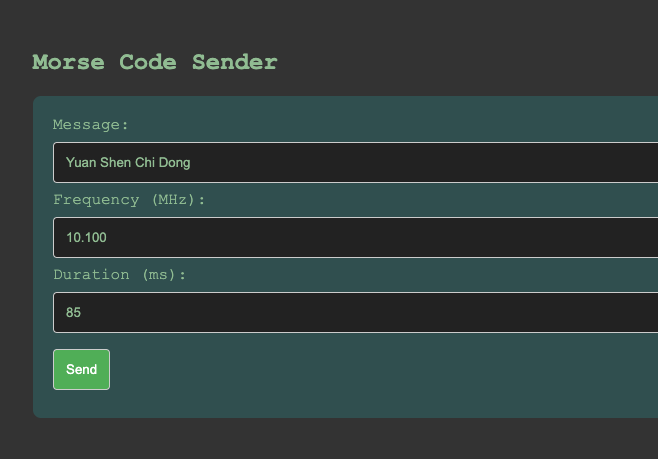

# ESP32 + SI5351 Morse Code Transmitter with PlatformIO

This project uses an ESP32 and an SI5351 clock generator to transmit Morse code messages. It leverages PlatformIO as the primary development environment, providing an easy way to manage project dependencies and configurations. Users can input Morse code transmission settings via a web page served by the ESP32 or by sending AT commands over a serial connection.

[Youtube Demo](https://youtube.com/shorts/I7Kv4bjHuSA?feature=share)


## Features

Web interface for inputting message, frequency, and duration for Morse code transmission.
Serial interface for receiving AT commands with similar capabilities.
Flexible and easily configurable with PlatformIO.

## Prerequisites

ESP32 development board
SI5351 clock generator module
PlatformIO IDE

## Getting Started

Clone the repository to your local machine.
Open the project with PlatformIO.
Connect the SI5351 module to your ESP32 following the module’s datasheet.
Build and upload the project to your ESP32 board.

src/wifi_credentials.h

```
// wifi_credentials.h
#ifndef WIFI_CREDENTIALS_H
#define WIFI_CREDENTIALS_H

#define WIFI_SSID "YourSSID"
#define WIFI_PASSWORD "YourPassword"

#endif
```

## Web Interface

The ESP32 hosts a web server that serves an HTML form for easy input of Morse code transmission parameters.


## Accessing the Web Page

Connect your computer or smartphone to the same network as the ESP32 and navigate to the ESP32's IP address using a web browser.

## Serial Interface

You can also send AT commands to the ESP32 via a serial connection to control Morse code transmission.

## AT Command Format

```
AT+SEND=message,frequency,duration
```

- message: The message to be transmitted in Morse code.
- frequency: Transmission frequency in Hz.
- duration: Duration of each Morse code dot in milliseconds.

# RF Usage Warning

When using RF modules, it's crucial to comply with local regulations concerning radio frequency emissions. Unauthorized or improper use of RF devices may cause harmful interference to other radio communications, leading to legal consequences. Ensure that your use of this project does not disrupt normal RF activities in your vicinity.

https://en.wikipedia.org/wiki/WARC_bands

CW (Continuous Wave) Morse code is extremely popular in amateur radio, spanning multiple amateur radio bands. Due to its simplicity and efficiency, CW communication is allocated across many bands, ranging from Low Frequency (LF) to Ultra High Frequency (UHF). Here are some of the typical frequency allocations for CW operations within the most commonly used amateur radio bands:

- 160 Meter Band: 1.800 - 2.000 MHz, with CW operations usually focused around 1.800 - 1.835 MHz.
- 80 Meter Band: 3.500 - 4.000 MHz, with CW operations usually focused around 3.500 - 3.560 MHz.
- 40 Meter Band: 7.000 - 7.300 MHz, with CW operations usually focused around 7.000 - 7.040 MHz.
- 30 Meter Band (Data and CW operations only): 10.100 - 10.150 MHz.
- 20 Meter Band: 14.000 - 14.350 MHz, with CW operations usually focused around 14.000 - 14.070 MHz.
- 17 Meter Band: 18.068 - 18.168 MHz, with CW operations usually around 18.068 - 18.095 MHz.
- 15 Meter Band: 21.000 - 21.450 MHz, with CW operations usually focused around 21.000 - 21.070 MHz.
- 12 Meter Band: 24.890 - 24.990 MHz, with a smaller CW operation area, usually at the beginning of the band.
- 10 Meter Band: 28.000 - 29.700 MHz, with CW operations possible from 28.000 - 28.070 MHz,

but the CW area may be broader, especially during periods of high solar activity.
It is important to note that the above frequency allocations may vary according to specific regional regulations, so it is advisable to consult local frequency allocation regulations before operating. Some countries might have slightly different frequency restrictions or additional bands available for amateur radio use.

Due to its excellent performance at low signal strengths, CW is widely used for long-distance communication (DXing) and low-power (QRP) operations. Even in very crowded bands or environments with significant electromagnetic interference (EMI), CW signals can be received and decoded, making it one of the most popular modes in amateur radio operations.

Data and CW Operations Only: In certain amateur radio bands, operations are restricted exclusively to data (such as digital modes) and CW (Continuous Wave, i.e., Morse code) to minimize interference and maintain clarity within the band. These restrictions are designed to ensure that these narrower bandwidth modes, which are capable of effective communication at lower signal strengths, can operate without undue interference from wider bandwidth modes like voice communication. This policy helps to optimize the use of available spectrum and facilitate diverse amateur radio activities within designated frequency bands.

# Contributions

Contributions are welcome! Feel free to fork the project and submit a pull request with your improvements.
